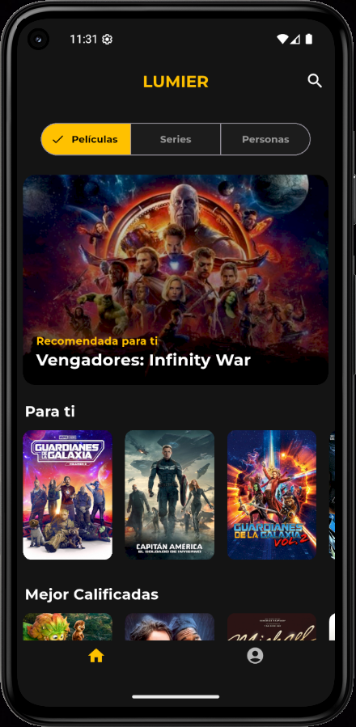
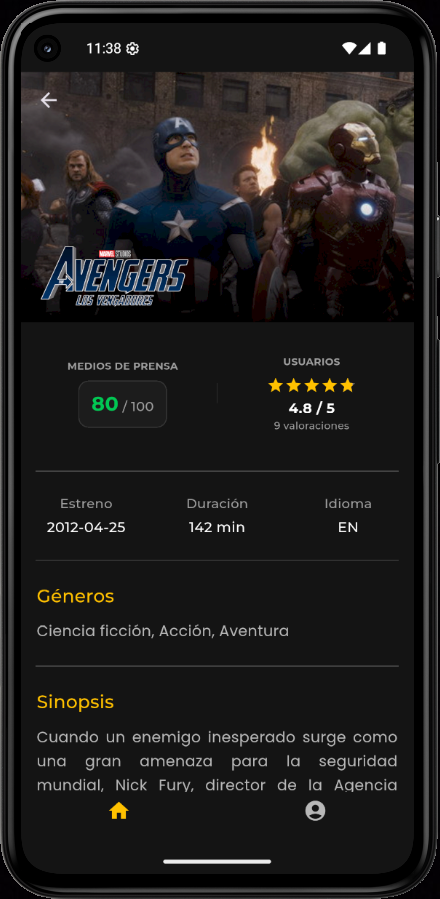
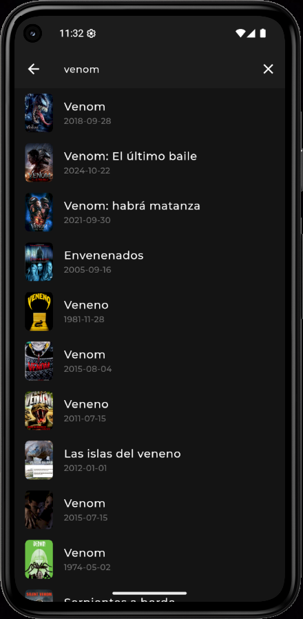
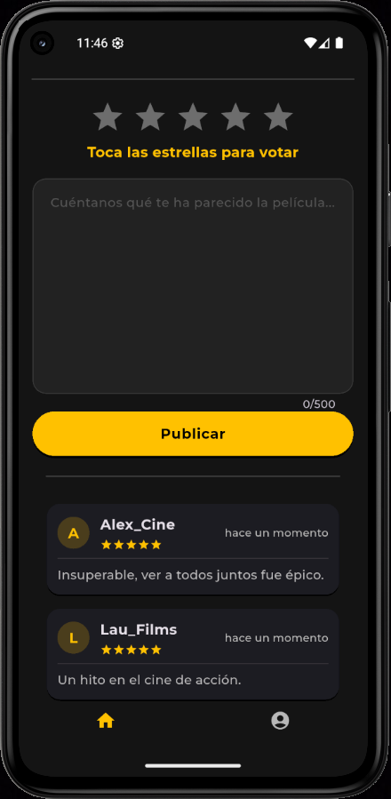
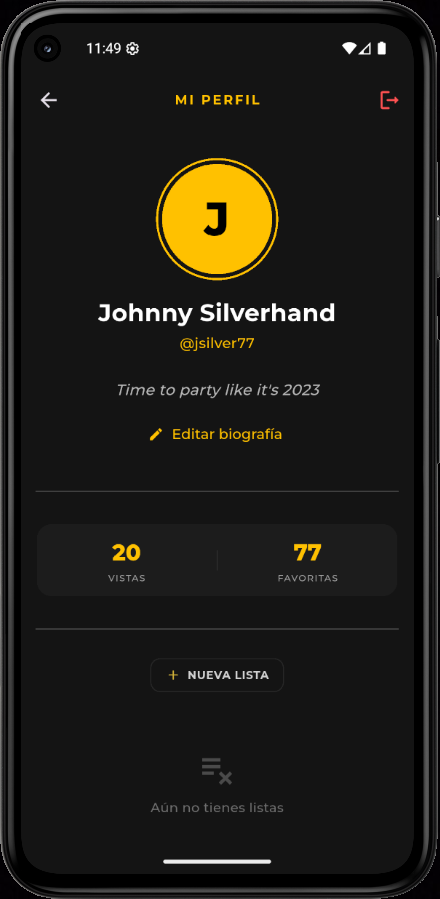

# Lumier 🎬

[🇪🇸 Español](#-español) | [🇬🇧 English](#-english)

---

## 🇪🇸 Español


Lumier es una aplicación de catálogo y recomendación de películas. Combina datos de [TMDB](https://www.themoviedb.org/) con un backend propio que gestiona usuarios, listas personalizadas, reseñas y recomendaciones.

El proyecto está dividido en dos partes independientes dentro de este mismo repositorio:

- **`lumier_back/`** — API REST en Spring Boot (Java).
- **`lumier_front/`** — App móvil en Flutter.

## Funcionalidades

- Registro e inicio de sesión de usuarios (contraseñas hasheadas con BCrypt).
- Catálogo de películas obtenido de TMDB: destacadas, mejor valoradas, por género, superhéroes, búsqueda...
- Ficha de película con reseñas de usuarios.
- Listas personalizadas.
- Recomendaciones personalizadas por usuario.
- Perfil de usuario con biografía editable y estadísticas (total de vistas / favoritos).

## Stack técnico

- **Frontend:** Flutter / Dart
- **Backend:** Spring Boot 4, Spring Data JPA, Spring Security
- **Base de datos:** MySQL
- **API externa:** [TMDB API](https://www.themoviedb.org/settings/api)


## Capturas de pantalla

<table>
  <tr>
    <td align="center"><br/>Inicio</td>
    <td align="center"><br/>Ficha de película</td>
    <td align="center"><br/>Búsqueda</td>
    <td align="center"><br/>Publicar reseña</td>
    <td align="center"><br/>Perfil</td>
  </tr>
</table>

## Puesta en marcha

### Requisitos previos

- JDK 25
- MySQL corriendo en local (o accesible por red)
- Flutter SDK
- Un emulador Android/iOS configurado, o un dispositivo físico
- Una API key de TMDB ([solicítala aquí](https://www.themoviedb.org/settings/api), es gratuita)

### 1. Backend (`lumier_back`)

1. Crea la base de datos (vacía) en MySQL:
   ```sql
   CREATE DATABASE LumierDB;
   ```
   No hace falta crear las tablas a mano: al arrancar el backend (paso siguiente), Hibernate lee las entidades JPA del proyecto y crea automáticamente todas las tablas dentro de `LumierDB`. Si quieres ver esa estructura sin bucear en el código Java, está documentada en [`lumier_back/docs/schema.sql`](lumier_back/docs/schema.sql).
2. Copia el fichero de ejemplo y rellena tus datos:
   ```bash
   cd lumier_back/src/main/resources
   cp application.properties.example application.properties
   ```
   Edita `application.properties` con tu usuario/contraseña de MySQL y tu API key de TMDB.

3. Arranca el servidor:
   ```bash
   cd lumier_back
   ./mvnw spring-boot:run
   ```
   El backend queda escuchando en `http://localhost:8080`. Las tablas se crean automáticamente al arrancar (`spring.jpa.hibernate.ddl-auto=update`).

### 2. Frontend (`lumier_front`)

```bash
cd lumier_front
flutter pub get
flutter run
```

Con el emulador Android ya abierto, `flutter run` lo detecta automáticamente. Puedes elegir un dispositivo concreto con `flutter run -d <device_id>` (usa `flutter devices` para listarlos).

> **Nota sobre la URL del backend:** el frontend apunta a `http://10.0.2.2:8080`, que es la dirección especial con la que el **emulador de Android** accede al `localhost` de tu máquina anfitriona. Si pruebas en el **simulador de iOS** usa `localhost:8080` directamente; si pruebas en un **dispositivo físico**, usa la IP local de tu PC en la red (por ejemplo `192.168.1.x:8080`) y asegúrate de que el firewall permite la conexión. Estas URLs están definidas en `lib/services/*.dart`.

---

## Estructura del backend

```
lumier_back/src/main/java/com/example/lumier/
├── controller/     # Endpoints REST
├── service/        # Lógica de negocio (TMDB, recomendaciones)
├── repository/      # Acceso a datos (Spring Data JPA)
├── model/          # Entidades JPA
├── DTO/            # Objetos de transferencia de datos
└── config/         # Configuración de seguridad
```

### Endpoints principales

| Método | Ruta | Descripción |
|---|---|---|
| `POST` | `/api/usuarios/registro` | Registro de usuario |
| `POST` | `/api/usuarios/login` | Inicio de sesión |
| `GET` | `/api/usuarios/perfil/{id}` | Perfil y estadísticas de usuario |
| `PUT` | `/api/usuarios/biografia/{id}` | Actualizar biografía |
| `GET` | `/api/movies/lista/{endpoint}` | Listado de películas (top rated, populares...) |
| `GET` | `/api/movies/genero/{idGenero}` | Películas por género |
| `GET` | `/api/movies/buscar` | Búsqueda de películas |
| `POST` | `/api/movies/resena` | Publicar una reseña |
| `GET` | `/api/movies/resenas/{tmdbId}` | Reseñas de una película |
| `GET` | `/api/recomendaciones/{idUsuario}` | Recomendaciones personalizadas |
| `POST` | `/api/listas/crear` | Crear una lista |
| `POST` | `/api/listas/agregarPelicula` | Añadir película a una lista |
| `POST` | `/interacciones/toggle` | Marcar/desmarcar favorito o vista |

## Estructura del frontend

```
lumier_front/lib/
├── pages/      # Pantallas (welcome, login, register, home, movie_details, user_profile)
├── services/   # Llamadas HTTP al backend
├── models/     # Modelos de datos
├── widgets/    # Componentes reutilizables
└── utils/      # Estilos y utilidades
```

---

## Notas de desarrollo

Este proyecto ha sido desarrollado como Trabajo de Fin de Ciclo (TFC) para el grado de Desarrollo de Aplicaciones Multiplataforma (DAM).

Debido a los plazos de entrega del curso y a la necesidad académica de demostrar conocimientos en una amplia variedad de metodologías de trabajo, el desarrollo se ha centrado en abarcar un abanico diverso de funciones (integración de backend, frontend, bases de datos, manejo de datos, consumo de APIs externas...). Por este motivo, es posible que algunas funcionalidades básicas o de gestión de errores detallada no estén implementadas por completo, priorizando la variedad técnica sobre la exhaustividad de cada módulo.

## Licencia

Este proyecto se distribuye bajo la Licencia MIT.

---

## 🇬🇧 English


Lumier is a movie catalog and recommendation app. It combines data from [TMDB](https://www.themoviedb.org/) with a custom backend that manages users, personalized lists, reviews, and recommendations.

The project is split into two independent parts within this same repository:

- **`lumier_back/`** — REST API built with Spring Boot (Java).
- **`lumier_front/`** — Mobile app built with Flutter.

## Features

- User registration and login (passwords hashed with BCrypt).
- Movie catalog sourced from TMDB: featured, top rated, by genre, superheroes, search...
- Movie detail page with user reviews.
- Personalized lists.
- Personalized recommendations per user.
- User profile with editable bio and stats (total views / favorites).

## Tech stack

- **Frontend:** Flutter / Dart
- **Backend:** Spring Boot 4, Spring Data JPA, Spring Security
- **Database:** MySQL
- **External API:** [TMDB API](https://www.themoviedb.org/settings/api)

## Screenshots

<table>
  <tr>
    <td align="center"><br/>Home</td>
    <td align="center"><br/>Movie details</td>
    <td align="center"><br/>Search</td>
    <td align="center"><br/>Post a review</td>
    <td align="center"><br/>Profile</td>
  </tr>
</table>

## Getting started

### Prerequisites

- JDK 25
- MySQL running locally (or accessible over the network)
- Flutter SDK
- An Android/iOS emulator set up, or a physical device
- A TMDB API key ([request one here](https://www.themoviedb.org/settings/api), it's free)

### 1. Backend (`lumier_back`)

1. Create an empty database in MySQL:
   ```sql
   CREATE DATABASE LumierDB;
   ```
   You don't need to create the tables by hand: when the backend starts (next step), Hibernate reads the project's JPA entities and automatically creates all the tables inside `LumierDB`. If you want to see that structure without digging through the Java code, it's documented in [`lumier_back/docs/schema.sql`](lumier_back/docs/schema.sql).
2. Copy the example file and fill in your own values:
   ```bash
   cd lumier_back/src/main/resources
   cp application.properties.example application.properties
   ```
   Edit `application.properties` with your MySQL username/password and your TMDB API key.

3. Start the server:
   ```bash
   cd lumier_back
   ./mvnw spring-boot:run
   ```
   The backend listens on `http://localhost:8080`. Tables are created automatically on startup (`spring.jpa.hibernate.ddl-auto=update`).

### 2. Frontend (`lumier_front`)

```bash
cd lumier_front
flutter pub get
flutter run
```

With the Android emulator already open, `flutter run` detects it automatically. You can pick a specific device with `flutter run -d <device_id>` (use `flutter devices` to list them).

> **Note on the backend URL:** the frontend points to `http://10.0.2.2:8080`, which is the special address the **Android emulator** uses to reach your host machine's `localhost`. If you're testing on the **iOS simulator**, use `localhost:8080` directly; if you're testing on a **physical device**, use your PC's local network IP (e.g. `192.168.1.x:8080`) and make sure your firewall allows the connection. These URLs are defined in `lib/services/*.dart`.

---

## Backend structure

```
lumier_back/src/main/java/com/example/lumier/
├── controller/     # REST endpoints
├── service/        # Business logic (TMDB, recommendations)
├── repository/      # Data access (Spring Data JPA)
├── model/          # JPA entities
├── DTO/            # Data transfer objects
└── config/         # Security configuration
```

### Main endpoints

| Method | Route | Description |
|---|---|---|
| `POST` | `/api/usuarios/registro` | User registration |
| `POST` | `/api/usuarios/login` | Login |
| `GET` | `/api/usuarios/perfil/{id}` | User profile and stats |
| `PUT` | `/api/usuarios/biografia/{id}` | Update bio |
| `GET` | `/api/movies/lista/{endpoint}` | Movie listings (top rated, popular...) |
| `GET` | `/api/movies/genero/{idGenero}` | Movies by genre |
| `GET` | `/api/movies/buscar` | Movie search |
| `POST` | `/api/movies/resena` | Post a review |
| `GET` | `/api/movies/resenas/{tmdbId}` | Reviews for a movie |
| `GET` | `/api/recomendaciones/{idUsuario}` | Personalized recommendations |
| `POST` | `/api/listas/crear` | Create a list |
| `POST` | `/api/listas/agregarPelicula` | Add a movie to a list |
| `POST` | `/interacciones/toggle` | Toggle favorite or watched |

## Frontend structure

```
lumier_front/lib/
├── pages/      # Screens (welcome, login, register, home, movie_details, user_profile)
├── services/   # HTTP calls to the backend
├── models/     # Data models
├── widgets/    # Reusable components
└── utils/      # Styles and utilities
```

---

## Development notes

This project was developed as a Final Degree Project (TFC) for the Multiplatform Application Development (DAM) program.

Due to the course's delivery deadlines and the academic need to demonstrate knowledge across a wide range of methodologies, development focused on covering a diverse set of features (backend/frontend integration, databases, data handling, external API consumption...). For this reason, some basic features or detailed error handling may not be fully implemented, as technical breadth was prioritized over the exhaustiveness of each module.

## License

This project is distributed under the MIT License.
